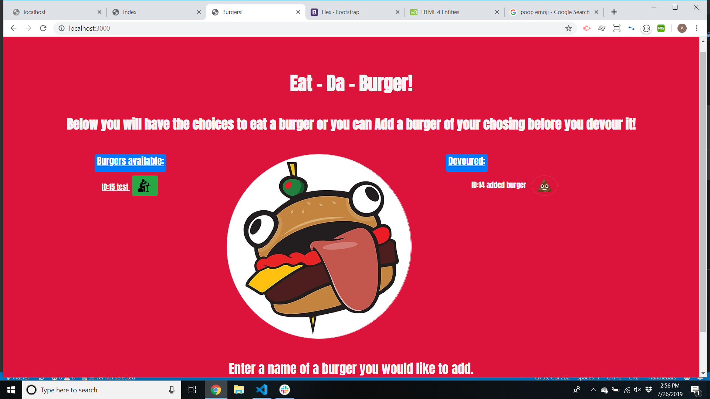

<h1 align="center">Welcome to burger 👋</h1>
<p>
  
  <a href="https://github.com/ABooth9422/burger/readme.md">
    
  </a>
</p>

> Full Stack deployable application

### 🏠 [Homepage](https://github.com/ABooth9422/burger)

## Burger


## Install

```sh
web based application visit site to begin
```

## Usage!

Below there will be a list of pre-existing burgers that we have created in the my-sql database. If you

would like to devour one of these tasty burgers you can click on the button next to the burger. If you would

like to delete the burger from the table by clicking once it has been devoured you can do so by clicking the button beside 

the burger. You also have the option to add any burger that you like to the menu before it is devoured!

## Author

👤 **Aaron Booth**

* Github: [@ABooth9422](https://github.com/ABooth9422)

## 🤝 Contributing

Contributions, issues and feature requests are welcome!<br />Feel free to check [issues page](https://github.com/ABooth9422/burger/issues).

## Show your support

Give a ⭐️ if this project helped you!

***
_This README was generated with ❤️ by [readme-md-generator](https://github.com/kefranabg/readme-md-generator)_